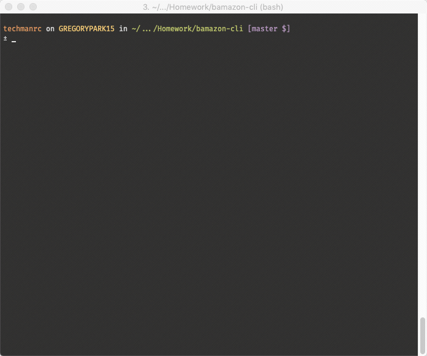
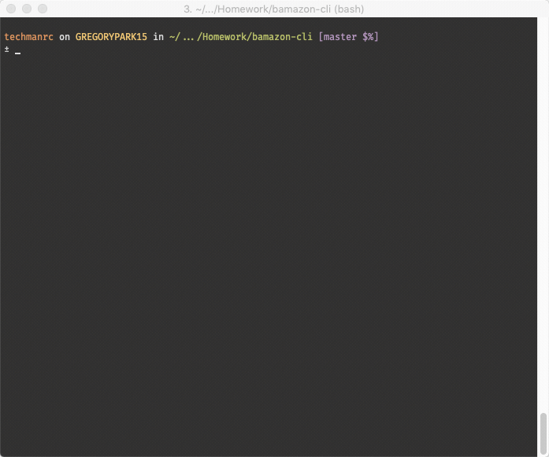
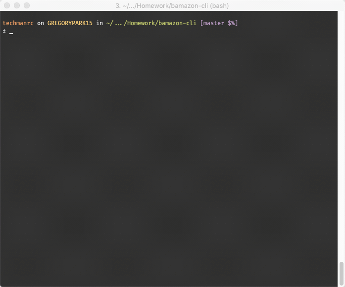
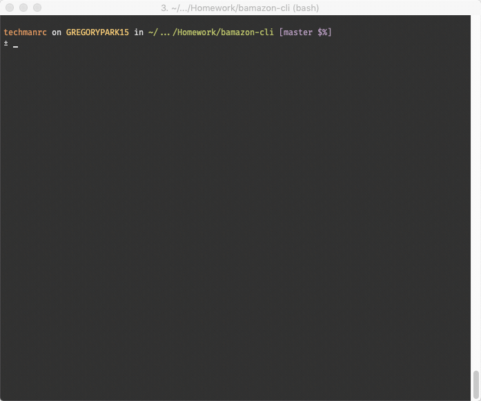
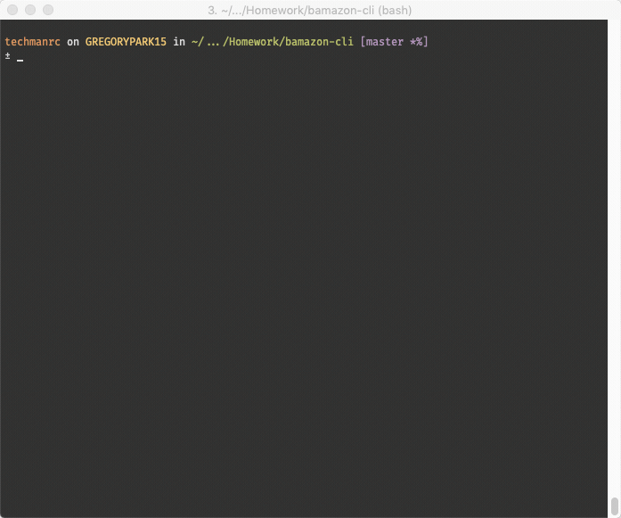
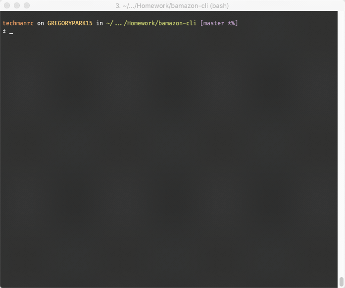
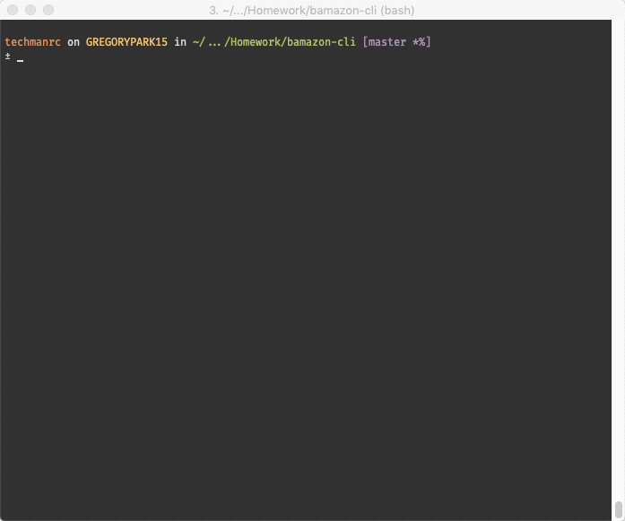
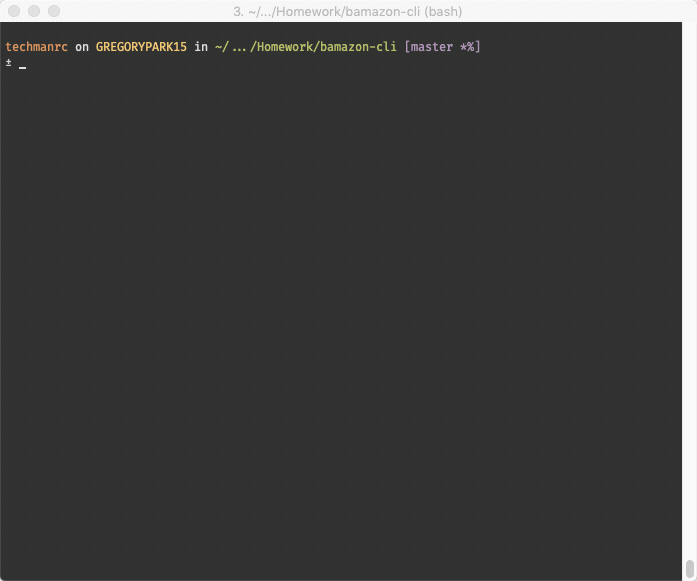
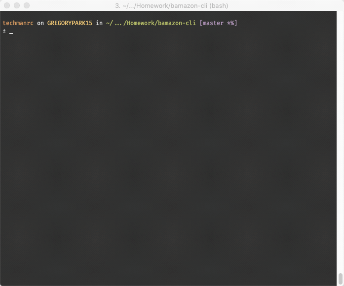

# Bamazon

This activity is about creating storefront with node.js and MySQL.

There are three applications in this exercise:

* **bamazonCustomer.js**: The interface for a customer to purchase products.
* **bamazonManager.js**: The interface for the store managers to view products, manage inventory levels, and to add new products.
* **bamazonSupervisor.js**: An interface for managing the available product departments and for reviewing Product Sales by Department.

## Prepare the Applications

To use the applications:

1. Clone the repository to your computer.
2. Once cloned, change into the directory with the cloned files.
3. At the command prompt type `npm install` and press <Enter>
4. While in the root folder of the project, create a file called `.env`.
5. Within the `.env` file, create the following entries:

```dotenv
DB_USER=<mysql_db_user>
DB_PASSWORD=<mysql_db_user_password>
```
   
   There should be no spaces around the equal sign, and the values should 
   not be surrounded by quotes.
6. Save the file once you have updated the credentials.
7. Edit the `bamazon.sql` file.
8. Un-comment lines 1 through 4.
9. Supply the password on line 2 between the single quotes.
10. On the command line execute the following:

```bash
mysql -u root < bamazon.sql
mysql -u root < bamazon_supervisor.sql
```

## bamazonCustomer.js

When the `bamazonCustomer.js` application is launched, a list of the currently available products are displayed. The customer is then asked to choose an item for purchase, by entering the Id of the item. If they have selected a valid Id, then they are asked to enter how many of the selected product they would like to purchase. If the item Id and the quantity to purchase are valid, the sale is completed and the customer is shown the total price for their purchase. They are then asked if they'd like to make another purchase or exit.

### Demonstration

The images below demonstrate each of the functions required by the exercise.

#### Quit during the purchase process

These demonstrations shows the ability to quit from the purchasing screens




#### Product Id and Quantity Validation

This demonstration shows input validation for the product Id. This is when the customer enters and Id for something that is not in the list displayed. 



This demonstration shows input validation for the stock amount. Primarily for those cases where the customer attempts to purchase more than are available in stock. 


#### Successful Purchase

This demonstrates a successful purchase, including the display of the final purchase price.




## bamazonManager.js

The `bamazonManager.js` application presents the manager with a menu of options for managing store inventory.

* **_View Products for Sale_** lists all of the items in the store:
    * The item Id
    * The product name
    * The department name
    * The amount in stock
    * The unit price

    

* **_View Low Inventory_** lists all items that have a stock quantity less than 5.
    

* **_Manage Stock Levels_** allows the manager to update the amount of available stock for any item in the store.
    

* **_Add New Product_** allows the manager to add a new product to the store.
    

### bamazonSupervisor.js

The `bamazonSupervisor.js` application presents the supervisor with a menu of options:

* **_View Product Sales by Department_** displays the Sales by department joining information from the `products` and `departments` tables and adding a calculated column in the query result.
    

* **_Create New Department_** allows the supervisor to add another department (product category) for new products.
    

